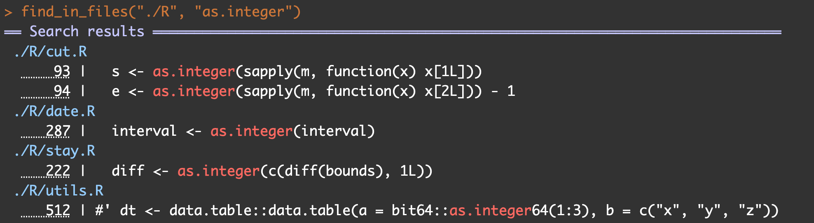
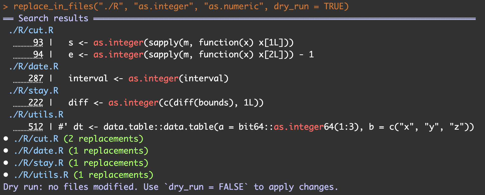

# instead


**`instead`** is a functional toolkit for efficient and reproducible programming. It provides high-performance utilities for vectors and matrices, memory-aware transformations for `data.table`, and advanced metaprogramming tools such as argument capture and call tracing (e.g., `capture_names()`, `trace_arg_expr()`).

The package also includes core helpers specialized for **insurance (inpatient stay) data handling**, intended as a foundation for more specialized analytical packages. Selected routines are implemented in C for speed.

The name **`instead`** reflects both its practical role as the *INSurance Toolkit for Efficient Analytics & Development* and its use as an alternative, streamlined set of programming aids.

[](https://CRAN.R-project.org/package=instead) [](https://github.com/seokhoonj/instead/actions/workflows/R-CMD-check.yaml)

## Installation

You can install the development version of instead from [GitHub](https://github.com/seokhoonj/instead) with:

``` r
# install.packages("devtools")
devtools::install_github("seokhoonj/instead")
```

## 1. Metaprogramming Tools

------------------------------------------------------------------------

### 1) `capture_names()`

`capture_names()` normalizes flexible column specifications (character, numeric indices, bare symbols, or NSE calls) into a consistent character vector of valid column names.

``` r
library(instead)
library(rlang)

df <- iris

# Character vector
capture_names(df, c("Sepal.Length", "Petal.Width"))
#> [1] "Sepal.Length" "Petal.Width"

# Numeric indices
capture_names(df, c(1, 4))
#> [1] "Sepal.Length" "Petal.Width"

# Bare symbols
capture_names(df, c(Sepal.Length, Petal.Width))
#> [1] "Sepal.Length" "Petal.Width"

# Inside wrapper functions (NSE-safe with rlang)
f1 <- function(data, x) capture_names(data, !!rlang::enquo(x))
f1(df, c(Sepal.Length, Petal.Width))
#> [1] "Sepal.Length" "Petal.Width"
```

### 2) `trace_arg_expr()`

`trace_arg_expr()` retrieves the original expression or symbol name passed to an argument, similar to substitute(), but resilient through nested calls and wrappers.

``` r
# Simple trace
trace_arg_expr(iris)
#> [1] "iris"

# Works through nested wrappers
f1 <- function(a) trace_arg_expr(a)
f2 <- function(b) f1(b)
f3 <- function(c) f2(c)

f3(iris)
#> [1] "iris"
```

## 2. Matrix

`instead` provides high-performance aggregation and transformation functions implemented in C. These allow grouping and summarizing by duplicated row/column names, rotating matrices, and computing row/column differences.

------------------------------------------------------------------------

### 1) Rotation & Aggregation functions

``` r
library(instead)

# create matrix
x <- matrix(c(1:9), nrow = 3)

# set dimension names
set_dimnames(x, list(c("a", "a", "b"), c("a", "b", "b")))
#>   a b b
#> a 1 4 7
#> a 2 5 8
#> b 3 6 9

# rotation
rotate(x, 180)
#>   b b a
#> b 9 6 3
#> a 8 5 2
#> a 7 4 1

# aggregate by row names
sum_by_rownames(x)
#>   a b  b
#> a 3 9 15
#> b 3 6  9
max_by_rownames(x)
#>   a b b
#> a 2 5 8
#> b 3 6 9
min_by_rownames(x)
#>   a b b
#> a 1 4 7
#> b 3 6 9

# aggregate by column names
sum_by_colnames(x)
#>   a  b
#> a 1 11
#> a 2 13
#> b 3 15
max_by_colnames(x)
#>   a b
#> a 1 7
#> a 2 8
#> b 3 9
min_by_colnames(x)
#>   a b
#> a 1 4
#> a 2 5
#> b 3 6

# aggregate by both row and column names
sum_by_dimnames(x)
#>   a  b
#> a 3 24
#> b 3 15
max_by_dimnames(x)
#>   a b
#> a 2 8
#> b 3 9
min_by_dimnames(x)
#>   a b
#> a 1 4
#> b 3 6

# row sum, max, min
row_sum(x)
#> [1] 12 15 18

row_max(x)
#> [1] 7 8 9

row_min(x)
#> [1] 1 2 3

col_sum(x)
#> [1]  6 15 24

col_max(x)
#> [1] 3 6 9

col_min(x)
#> [1] 1 4 7
```

### 2) Insurance-specific matrix helpers

In insurance stay/claim data, it is common to apply rules such as:

-   **Pay only for the first positive event** in a sequence (e.g., first admission).
-   **Fill coverage until the first event** occurs, but not after.

These domain-specific rules are implemented as fast matrix transformations:

``` r
# fill with zero except for the first positive values of a numerical matrix by rownames
x <- matrix(c(-1, 2, 0, -2, -1, 5, 2, -2, 3), nrow = 3)
set_dimnames(x, list(c(1, 1, 2), c("a", "b", "c")))
#> x
#>    a  b  c
#> 1 -1 -2  2
#> 1  2 -1 -2
#> 2  0  5  3
fill_zero_not_first_pos(x)
#>   a b c
#> 1 0 0 2
#> 1 2 0 0
#> 2 0 5 3
set_zero_not_first_pos(x) # edit x directly

# fill with one before the first one appears in each column in a binary matrix by rownames
x <- matrix(c(0, 1, 0, 0, 0, 1, 1, 0, 1), nrow = 3)
set_dimnames(x, list(c(1, 1, 2), c("a", "b", "c")))
#> x
#>   a b c
#> 1 0 0 1
#> 1 1 0 0
#> 2 0 1 1
fill_one_before_first_one(x)
#>   a b c
#> 1 1 1 1
#> 1 1 1 0
#> 2 1 1 1
set_one_before_first_one(x) # edit x directly
```

## 3. Insurance Data Analysis (especially, inpatient stays)

------------------------------------------------------------------------

### 1) `collapse_date_ranges()`

`collapse_date_ranges()` merges overlapping—or near-adjacent—date ranges **within (id, group)** blocks. This is especially useful for *hospitalization* or *benefit* episodes where multiple claims for the same insured and product should be treated as a single continuous stay.

#### Why you’d use this

-   **De-duplicate fragmented stays** caused by claim splits.
-   **Control adjacency**: merge only overlapping dates, or also merge short gaps (e.g., transfers).
-   **Carry metadata**: combine auxiliary columns (e.g., ward, cause) across merged spans.
-   **Practical advantage**: Unlike SQL window functions or joins, which struggle with complex overlapping intervals, this function provides a reliable solution tailored for real-world insurance data.

#### Key behavior

-   Dates are **inclusive** (i.e., `stay = to - from + 1`).
-   `interval` controls what “continuous” means:
    -   `-1`: **require actual overlap** (touching ranges are *not* merged).
    -   `0`: merge **touching** ranges (e.g., `… to = 2022-03-10` and next `from = 2022-03-11`).
    -   `> 0`: allow up to `interval` days of **gap** and still merge.
-   Optional `merge_var` columns are **collapsed per merged span** (unique non-missing values, joined by `collapse`).

``` r
library(instead)
library(data.table)

# toy data: two insureds, with small gaps between stays
dt <- data.table::data.table(
  id    = c("A","A","B","B"),
  group = c("x","x","y","y"),
  work  = c("cleaning", "analysis", "cleaning", "QA"),
  from  = as.Date(c("2022-03-01","2022-03-05","2022-03-08","2022-03-12")),
  to    = as.Date(c("2022-03-06","2022-03-09","2022-03-10","2022-03-15"))
)

# 1) Merge touching ranges only (interval = 0)
collapse_date_ranges(
  dt,
  id_var = id, group_var = group, merge_var = work,
  from_var = from, to_var = to,
  interval = 0
)
#>       id  group             work       from         to  stay
#>   <char> <char>           <char>     <Date>     <Date> <num>
#> 1:     A     x cleaning|analysis 2022-03-01 2022-03-09     9
#> 2:     B     y       cleaning|QA 2022-03-08 2022-03-15     8

# 2) Require overlap (interval = -1)
# Here, spans that only touch (no overlap) remain separate.
collapse_date_ranges(
  dt,
  id_var = id, group_var = group, merge_var = work,
  from_var = from, to_var = to,
  interval = -1
)
#>      id group     work       from         to stay
#> 1:    A     x cleaning 2022-03-01 2022-03-06    6
#> 2:    A     x analysis 2022-03-05 2022-03-09    5
#> 3:    B     y cleaning 2022-03-08 2022-03-10    3
#> 4:    B     y       QA 2022-03-12 2022-03-15    4

# 3) Allow short gaps (interval = 2)
collapse_date_ranges(
  dt,
  id_var = id, group_var = group, merge_var = work,
  from_var = from, to_var = to,
  interval = 2, collapse = ", "
)
#>      id group               work       from         to stay
#> 1:    A     x cleaning, analysis 2022-03-01 2022-03-09    9
#> 2:    B     y       cleaning, QA 2022-03-08 2022-03-15    8
```

### 2) `count_stay()`

`count_stay()` counts the total number of unique stay days within groups. Overlapping or adjacent date ranges are merged internally, so days are not double-counted.

#### Why you’d use this

-   Measure the actual covered duration of inpatient stays.
-   Avoid inflating totals when multiple overlapping claims exist.

#### Key behavior

-   Dates are inclusive (stay = to - from + 1).
-   Overlaps and adjacencies are collapsed so each day is counted once.
-   Output is grouped by (id, group) combinations.

``` r
library(instead)

dt <- data.frame(
  id    = c(1, 1, 1, 2, 2, 2),
  group = c("a", "a", "a", "b", "b", "c"),
  from  = as.Date(c("2024-01-01", "2023-12-27", "2024-01-03",
                    "2024-02-01", "2024-02-05", "2025-02-05")),
  to    = as.Date(c("2024-01-07", "2025-01-05", "2025-01-07",
                    "2024-02-03", "2024-02-06", "2025-02-06"))
)

count_stay(dt, id, group, from, to)
#   id group stay
# 1  1     a  378
# 2  2     b    5
# 3  2     c    2
```

### 3) `limit_stay()`

`limit_stay()` applies insurance contract rules (limit, waiting period, deduction) to inpatient stays. Typical settings are:

-   limit = 180 days
-   waiting = 180 days
-   deduction = 90 days

#### Why you’d use this

-   Enforce contract terms where only a limited number of days are covered.
-   Exclude the initial months (waiting period).
-   Deduct a specified number of first covered days.

#### Key behavior

-   Results are aggregated at the monthly level for performance (not raw daily expansion).
-   Deduction is applied after limit/waiting rules.
-   Overlapping intervals should be merged beforehand (use collapse_date_ranges())

``` r
library(instead)
library(data.table)

dt <- data.table::data.table(
  id    = c(1, 1, 1, 2, 2),
  group = c("A", "A", "A", "B", "B"),
  from  = as.Date(c("2024-01-01", "2024-07-01", "2024-12-01",
                    "2024-02-01", "2024-02-15")),
  to    = as.Date(c("2024-01-20", "2024-07-10", "2024-12-15",
                    "2024-02-10", "2024-02-20"))
)

# Apply insurance rules: 180-day limit, 180-day waiting, 90-day deduction
limit_stay(dt, id, group, from, to,
           limit = 180, waiting = 180, deduction = 90)
```

## 4. Developer Utilities (Optional)

Large R projects often need quick ways to **locate** and optionally **replace** text across multiple files. `instead` provides two developer-focused utilities for this purpose:

------------------------------------------------------------------------

### 1) `find_in_files()`

Search within a folder, file, or glob pattern (e.g., `./R/*.R`) for lines containing a given pattern. Results are returned as a named list, where each element is a data frame with line numbers and text. In the console, matches are always highlighted in **red + bold**.

**Key Features:**

-   Works on single files, entire folders, or glob patterns.
-   Supports **recursive search** in subdirectories.
-   Case-insensitive by default, with optional regex or fixed search.
-   Skips non-text/binary formats by default (images, archives, etc.).
-   Can suppress line output (`show_lines = FALSE`) to only list filenames.
-   **Interactive output**: line numbers in the console act as clickable links, jumping to the corresponding file and line.

``` r
library(instead)

# Search all R files for "as.numeric"
find_in_files("./R", "as.numeric")

# Case-sensitive, fixed string match
find_in_files("./src", "malloc", ignore_case = FALSE, fixed = TRUE)
```



### 2) `replace_in_files()`

Search files for lines containing a given pattern and **replace** them with another string. This is especially useful for project-wide refactoring, renaming variables, or updating deprecated function calls.

**Key Features:**

-   Same flexible search options as `find_in_files()`.
-   Runs in **dry-run mode by default** (shows what would change but does not modify files).
-   Provides a per-file summary of how many replacements were made.

``` r
library(instead)

# Dry run: preview replacements of "as.integer" with "as.numeric" in R files
replace_in_files("./R", "as.integer", "as.numeric", dry_run = TRUE)

# Actually apply replacements (use with caution!)
replace_in_files("./R", "as.integer", "as.numeric", dry_run = FALSE)
```



### 3) `ensure_dt_env()`

Provides a lightweight execution environment for safely using `data.table` operations, regardless of whether the input is a base `data.frame`, a tibble, or already a `data.table`.

**Key Features:**

-   If the input is a `data.table`, it is returned as-is and can be modified **in place**.\
-   If the input is a `data.frame` or tibble, a **copy** is made, converted to `data.table`, and safely restored back to the original type after modification.\
-   Returns a small "environment object" with three components:
    -   `dt`: the working `data.table` (safe to modify)
    -   `restore()`: a function that restores results to the original input class
    -   `inplace`: flag indicating whether the input was already a `data.table`

This is especially useful for package functions that rely on in-place `data.table` semantics but should still respect the user’s original data type.

``` r
library(instead)
library(data.table)

df <- data.frame(x = 1:3, y = 4:6)

# Wrap into a data.table environment
env <- ensure_dt_env(df)

# Work with data.table
dt <- env$dt
dt[, z := x + y]

# Restore to original class (data.frame)
env$restore(dt)
#>   x y z
#> 1 1 4 5
#> 2 2 5 7
#> 3 3 6 9
```

## 5. Other Utilities

``` r
library(instead)

# Count unique elements (fast alternative to length(unique(x)))
x <- c(1, 1, 2, 3, 4, 5, 5)
unilen(x)
#> [1] 5

# Reverse the order of elements directly (in place)
x <- 1:9
reverse(x) # modifies x directly
x
#> [1] 9 8 7 6 5 4 3 2 1

# Interleave two vectors (alternate elements from each)
x <- c(1, 3, 5, 7)
y <- c(2, 4, 6, 8)
interleave(x, y)
#> [1] 1 2 3 4 5 6 7 8

# Expand to daily sequences
from <- as.Date(c("2024-01-01", "2024-02-01"))
to <- as.Date(c("2024-01-03", "2024-02-02"))
seq_date_list(from, to, label = c("A", "B")) 
#> $A
#> [1] "2024-01-01" "2024-01-02" "2024-01-03"
#>
#> $B
#> [1] "2024-02-01" "2024-02-02"
```
